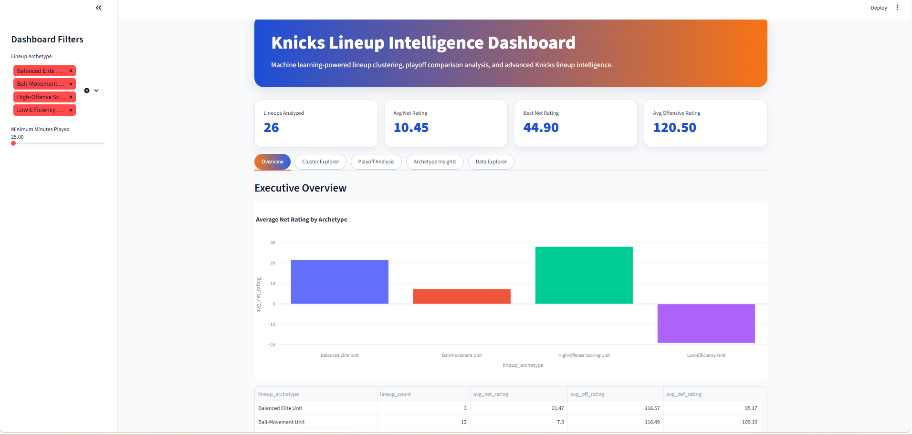

# Knicks Lineup Intelligence & Clustering

Machine learning-powered lineup intelligence and playoff analytics for the New York Knicks using NBA lineup data, feature engineering, clustering, dimensionality reduction, SQL analytics, and interactive dashboarding.

---
## Dashboard Preview


---

## Project Overview

This project analyzes New York Knicks lineup combinations to identify lineup archetypes, offensive and defensive identities, playoff performance shifts, and lineup stability patterns using unsupervised machine learning techniques.

The project combines:
- NBA lineup ingestion
- advanced feature engineering
- KMeans clustering
- PCA dimensionality reduction
- playoff vs regular season analysis
- DuckDB + SQL analytics
- interactive Streamlit dashboarding
- lineup relationship/network analysis

The objective is to understand:
- lineup efficiency
- offensive and defensive identity
- playoff adaptation
- lineup stability
- player combinations
- lineup survivability
- postseason performance shifts

---

## Tech Stack

- Python
- Pandas
- NumPy
- scikit-learn
- Plotly
- Streamlit
- DuckDB
- NetworkX
- Matplotlib
- NBA API
- Statsmodels

---

## Project Objectives

- Analyze Knicks lineup combinations
- Engineer advanced lineup features
- Identify lineup archetypes using clustering
- Compare regular season vs playoff lineup behavior
- Visualize lineup clusters and relationships
- Build a production-style analytics workflow
- Create an interactive dashboard experience

---

## Data Sources

NBA lineup data was collected using the `nba_api` package from:
- Regular Season lineup data
- Playoff lineup data

Metrics analyzed include:
- offensive rating
- defensive rating
- net rating
- pace
- assist percentage
- rebounding percentage
- true shooting percentage
- lineup minutes

---

## Feature Engineering

Several custom features were engineered throughout the workflow.

### Two-Way Score

Measures overall lineup balance between offense and defense.

```python
two_way_score = off_rating - def_rating
```

### Lineup Stability Score

Measures lineup usage and coaching trust.

```python
lineup_stability_score = lineup_minutes / total_minutes
```

### Playoff Delta Features

Measures lineup performance changes from regular season to playoffs.

```python
net_rating_delta
off_rating_delta
def_rating_delta
minutes_delta
```

### Lineup Archetypes

KMeans clustering was used to identify:
- Balanced Elite Units
- High-Offense Scoring Units
- Ball-Movement Units
- Low-Efficiency Units

---

## Machine Learning Workflow

### KMeans Clustering

KMeans clustering grouped lineups based on advanced lineup metrics.

### PCA (Principal Component Analysis)

PCA reduced high-dimensional lineup data into two dimensions for visualization and cluster analysis.

### Elbow Method

The Elbow Method was used to determine the optimal number of clusters.

### Silhouette Score

Silhouette scoring was used to evaluate cluster quality and separation.

---

## Playoff Analysis

A secondary playoff analysis workflow compared:
- lineup performance changes
- rotation tightening
- playoff survivability
- offensive and defensive efficiency shifts

The project identified several lineup combinations that improved defensive efficiency during postseason rotations despite reduced usage.

---

## Visualizations

The project includes:
- PCA cluster visualizations
- lineup stability vs performance analysis
- playoff performance delta charts
- network graphs for player relationships
- archetype comparison charts
- interactive Plotly analytics

---

## Dashboard

An interactive Streamlit dashboard was developed featuring:
- lineup archetype explorer
- ML cluster visualization
- lineup performance analysis
- playoff comparison insights
- interactive data explorer
- downloadable filtered datasets
- interactive Plotly visualizations

---

## DuckDB & SQL Analytics

DuckDB was used for lightweight analytical warehousing and SQL querying.

SQL analyses include:
- top offensive lineups
- best defensive lineups
- most-used lineups
- archetype performance summaries
- playoff performance delta analysis

---

## Network Graph Analysis

NetworkX was used to create player relationship graphs showing:
- lineup connectivity
- player chemistry
- shared lineup minutes
- high-performing player combinations

---

## Project Structure

```text
knicks-lineup-intelligence/
│
├── assets/
│
├── dashboard/
│   └── app.py
│
├── data/
│   ├── raw/
│   └── processed/
│
├── database/
│   └── knicks_lineup_intelligence.duckdb
│
├── models/
│   ├── kmeans_model.pkl
│   └── scaler.pkl
│
├── notebooks/
│   ├── lineup_data_ingestion.ipynb
│   ├── lineup_feature_engineering.ipynb
│   ├── lineup_clustering_model.ipynb
│   └── playoff_lineup_analysis.ipynb
│
├── sql/
│   └── lineup_analytics.sql
│
├── src/
│   ├── load/
│   ├── modeling/
│   └── transform/
│
├── requirements.txt
└── README.md
```

---

## Example Insights

- Distinct lineup archetypes emerged from clustering analysis
- Some highly-used lineups were not the highest-performing units
- Ball-movement lineups exhibited strong assist-driven profiles
- Offensive-heavy units produced elite scoring efficiency but weaker defense
- Several playoff lineups improved defensive efficiency despite reduced usage
- Certain player combinations consistently appeared in elite-performing lineups

---

## Future Improvements

- Add matchup-specific analysis
- Add live NBA API ingestion
- Add player-level RAPM features
- Add predictive lineup simulations
- Add playoff series segmentation
- Deploy dashboard to Streamlit Cloud

---

## How to Run

### Clone Repo

```bash
git clone https://github.com/kale2861/knicks-lineup-intelligence.git
cd knicks-lineup-intelligence
```

### Install Requirements

```bash
pip install -r requirements.txt
```

### Run Dashboard

```bash
streamlit run dashboard/app.py
```

---

## Author

Built by Sena Kaledzi

GitHub:
https://github.com/kale2861